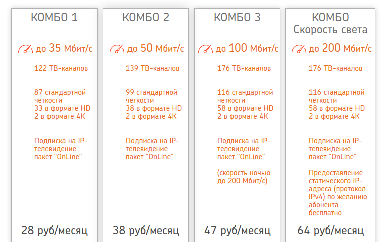

- Website: https://www.help.github.io
- Forums: [HashiCorp Discuss](https://discuss.hashicorp.com/c/terraform-core)
- Documentation: [https://www.terraform.io/docs/](https://www.terraform.io/docs/)
- Tutorials: [HashiCorp's Learn Platform](https://learn.hashicorp.com/terraform)
- Certification Exam: [HashiCorp Certified: Terraform Associate](https://www.hashicorp.com/certification/#hashicorp-certified-terraform-associate)

Усилители wi-fi сигнала предоставляется только на ТП КОМБО СКОРОСТЬ СВЕТА и
СКОРОСТЬ СВЕТА.
Роутер 1Gbit предоставляется на ТП КОМБО 3, КОМБО СКОРОСТЬ СВЕТА, 3-я КОСМИЧЕСКАЯ,
СКОРОСТЬ СВЕТА.
Повторные выезды по одной и той же проблеме (Пример:смена РЧК) платные.

Старый роутер остается у абонента и он продолжает за него выплачивать (в случае,
если он приобретен в рассрочку).

Старый ЦПКТ/САМ остается у абонента и он продолжает за него выплачивать (в случае,
если он приобретен в рассрочку).
Стоимость выезда по замене не вышедшего из строя оборудования (абонент просто
захотел поменять): 8,00 руб + выезд в зону удаления.
Выезды по замене вышедшего из строя оборудования бесплатные.
В случае замены оборудования по гарантии (не прошло 12 мес. со дня продажи):
Возможна замена только на оборудование с такой же стоимостью, т. е.
Crenova-Crenova, Crenova-Konka, Konka-Konka, Konka-Crenova, Coship-Coship.
В случае замены оборудования не на аналогичное по стоимости –
индивидуально по звонку в техническую поддержку или абонентский отдел.

The key features of Terraform are:

- **Infrastructure as Code**: Infrastructure is described using a high-level configuration syntax. This allows a blueprint of your datacenter to be versioned and treated as you would any other code. Additionally, infrastructure can be shared and re-used.

- **Execution Plans**: Terraform has a "planning" step where it generates an *execution plan*. The execution plan shows what Terraform will do when you call apply. This lets you avoid any surprises when Terraform manipulates infrastructure.

- **Resource Graph**: Terraform builds a graph of all your resources, and parallelizes the creation and modification of any non-dependent resources. Because of this, Terraform builds infrastructure as efficiently as possible, and operators get insight into dependencies in their infrastructure.

- **Change Automation**: Complex changesets can be applied to your infrastructure with minimal human interaction. With the previously mentioned execution plan and resource graph, you know exactly what Terraform will change and in what order, avoiding many possible human errors.

For more information, see the [introduction section](http://www.terraform.io/intro) of the Terraform website.

Getting Started & Documentation
-------------------------------
Documentation is available on the [Terraform website](http://www.terraform.io):
  - [Intro](https://www.terraform.io/intro/index.html)
  - [Docs](https://www.terraform.io/docs/index.html)
